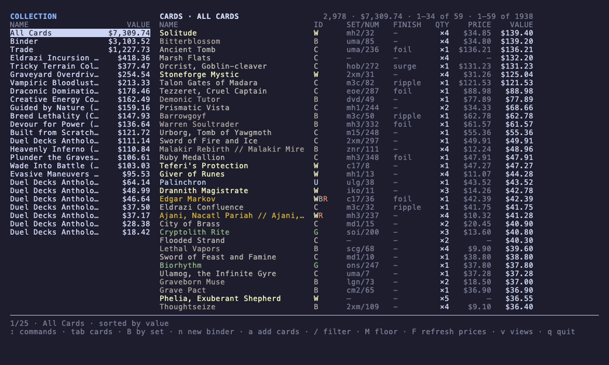

<p align="center">
    
</p>

# hoard

[](https://github.com/spiffcs/hoard/actions/workflows/validations.yaml)
[](https://github.com/spiffcs/hoard/releases)
[](LICENSE)

A TUI collection tracker for Magic: The Gathering.

Your cards and decks live in a single SQLite file on your machine, priced daily
from [MTGJSON](mtgjson.com) and [TCGCSV](https://tcgcsv.com/). Metadata and card information come from [Scryfall](https://scryfall.com/).

<p align="center">
    
</p>

## Install

```sh
curl -sSfL https://tools.aithirne.com/hoard/install.sh | sh -s -- -b /usr/local/bin
```

`tools.aithirne.com` is from the maintainer (see [triage](https://github.com/spiffcs/triage) as well). The script it serves is
[`install.sh`](install.sh) from this repository. The release workflow uploads
that exact file so you can read it here before running it, or check the two
match without taking anyone's word for it:

```sh
diff <(curl -sSfL https://tools.aithirne.com/hoard/install.sh) \
     <(curl -sSfL https://raw.githubusercontent.com/spiffcs/hoard/main/install.sh)
```

It downloads from this repository's releases and verifies the SHA-256. You can add `-v`
to verify the Sigstore signature too if you have cosign. A trailing tag pins the
version instead of taking the latest.

```sh
curl -sSfL https://tools.aithirne.com/hoard/install.sh | sh -s -- -v -b /usr/local/bin v0.1.0
```

#### Golang/Github Specific
`go install github.com/spiffcs/hoard/cmd/hoard@latest` (Go 1.26+), or take an
archive from the [releases page](https://github.com/spiffcs/hoard/releases). The
macOS binaries are signed and notarized and should open without a Gatekeeper
prompt; [RELEASE.md](RELEASE.md) covers verifying them.

If you want to look at the TUI before importing anything? `hoard demo` opens the browser on a small sample collection that is a database of its own your main hoard DB is never opened or clobbered.

## Bring Your Collection In

Most people arrive with an export from somewhere else. `hoard import` reads
ManaBox, Moxfield and Delver Lens CSVs. It's also backwards compatible with 
hoard's own format. Import sniffs the header, so the format usually needs no naming:

```console
$ hoard import manabox-export.csv
✓ Imported 1,284 cards (manabox format): 1,284 rows resolved.
```

Decks can be imported from an Archidekt URL, or from a pasted list:
```console
$ hoard deck add https://archidekt.com/decks/1234567/my-deck
$ pbpaste | hoard deck add --file - --name "Modern Burn"
```

Archidekt is the only site with a URL importer — Moxfield's API is behind
Cloudflare, and most others have none. Everywhere else, export the deck to text
and pipe it in: the plain `1 Sol Ring` / `1x Sol Ring (C21) 125` shape that
Moxfield, MTGGoldfish, TappedOut, EDHREC and Scryfall all export is read
directly, foil markers (`*F*`) and `SB:` sideboard lines included.

Archidekt's and Deckstats' text exports keep their sectioning: Archidekt's
`[Category]` blocks put the commander in the command zone and leave anything
marked `{noDeck}` on the maybeboard, and Deckstats' `//Commander` headers do the
same. Both are read as exported, categories and all.

Loose cards can go in one at a time by Scryfall link:
```console
$ hoard add https://scryfall.com/card/uma/7/ulamog-the-infinite-gyre
✓ Added 1× Ulamog, the Infinite Gyre (uma/7) as nonfoil into Binder · $37.35
```

`--dry-run` works on all three: resolve and report, write nothing. On an import,
`--preserve-binders` recreates the file's own binders instead of putting
everything in one.

## Try It

Run `hoard` with no arguments to see the browser, or `hoard help` for every command.
With nothing imported yet, `hoard demo` shows the same browser with sample data;
`hoard demo --reset` starts that sample over. When you're in the main browser you can use `:` to
view the main command palette.

<p align="center">
    
</p>

## Your data

| OS | Default location |
|---|---|
| macOS | `~/Library/Application Support/hoard/hoard.db` |
| Linux | `$XDG_DATA_HOME/hoard/hoard.db` (else `~/.local/share/hoard/hoard.db`) |

Override with `--db PATH` or `$HOARD_DB`. A schema upgrade backs the old file
up alongside it first. The card catalog and price downloads live in your cache
directory and are always safe to delete.

It is ordinary SQLite: read it with [any tool](schema/sqlite/README.md), or take
versioned JSON out with `hoard export --format json`
([schema](schema/json/README.md)).

## Scripting it

`--json` emits a versioned document instead of a table. `hoard schema` prints the
JSON Schema it validates against, and the schema files are published under
[`schema/json/`](schema/json/README.md) so a parser can pin a version.

Commands that do not honour `--json` **refuse** it rather than ignoring it —
output that silently dropped the flag would be indistinguishable, to a parser,
from output that respected it. `--dry-run` resolves and reports without writing.

Exit codes are decided in one place and are stable:

| Code | Meaning |
|---|---|
| 0 | Success |
| 1 | Failure — the error is on stderr |
| 2 | Partial Add: some of the cards landed, some did not |
| 3 | A watch fired. A result, not a failure — the alert is on stdout |
| 130 | Interrupted (SIGINT) |

```sh
hoard update-prices && hoard watch
```

## More

[CONTRIBUTING.md](CONTRIBUTING.md) · [AGENTS.md](AGENTS.md) · [RELEASE.md](RELEASE.md)
· [SECURITY.md](SECURITY.md) · [CODE_OF_CONDUCT.md](CODE_OF_CONDUCT.md)

## License and Legal

Code is [MIT](LICENSE) — © 2026 Christopher Phillips. Card imagery in this
repository remains the property of Wizards of the Coast and is **not** covered
by that license; see [NOTICE](NOTICE).

hoard is unofficial Fan Content permitted under the Fan Content Policy. Not
approved/endorsed by Wizards. Portions of the materials used are property of
Wizards of the Coast. ©Wizards of the Coast LLC.

Card data courtesy of [Scryfall](https://scryfall.com), [MTGJSON](https://mtgjson.com)
(MIT, © 2018–Present Zach Halpern) and [TCGCSV](https://tcgcsv.com). hoard is not
affiliated with, endorsed by, or sponsored by any of them. All prices are daily
estimates from third-party aggregators, not quotes, with absolutely no guarantee
— see stores for final prices.
